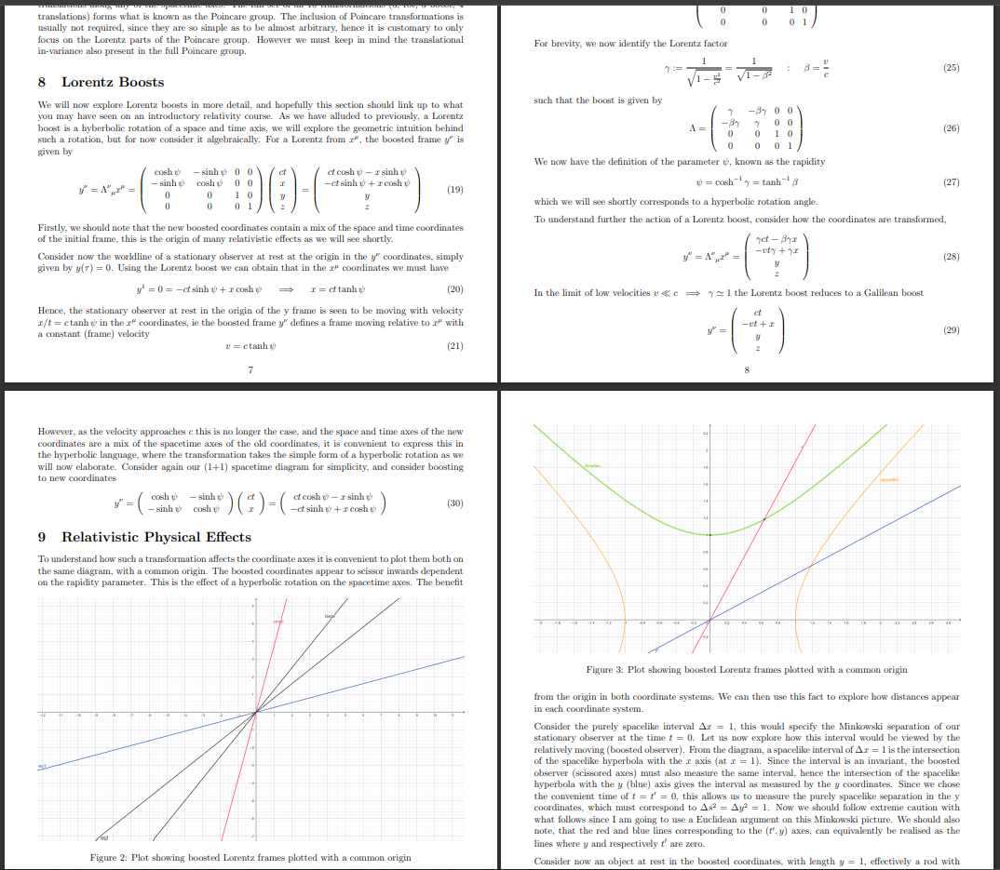
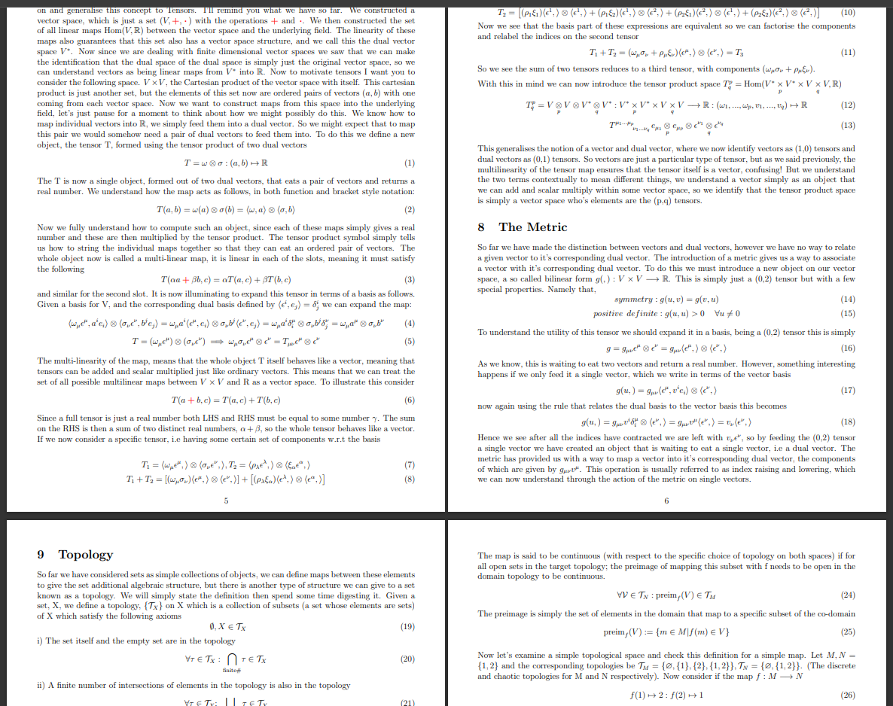
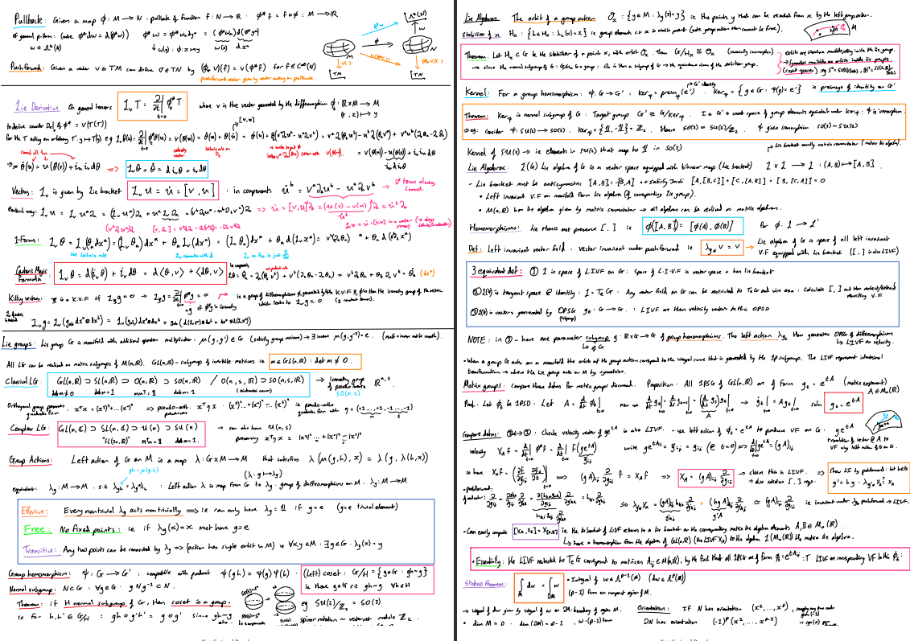

# WHYBmaths
This repository is for my YouTube channel WHYBmaths, where I post mathematical physics videos. Here you can find notes that I produced while making the videos, as well as a few notes I wrote whilst doing my masters degree!

# Notes

Here are some notes that I have written over the course of making these videos, and on my masters degree! The notes will be a bit rough and conversational at times, but hopefully they will be helpful in some way! The notes do quite closely follow the content in the videos, and there will be some things that either haven't been ilmed/edited yet, or that didn't quite make it into the videos! 

|[Relativity notes](./Notes/Relativity_Notes.pdf) | [Tensors, Topology, Manifolds notes](./Notes/TensorsTopologyManifolds.pdf) |
|-|-|
|||

Revision notes from my masters differential geometry exam.
|[Differential Geometry Revision Notes](./Relativity_Notes.pdf) | |
|-|-|
||

# MSc Thesis - Einstein-Cartan Gravity

This repository also contains a copy of my [MSc thesis](./MScThesis/Edge_Modes_and_Boundary_Condition_in_Gauge_Theories.pdf)

The thesis worked on an open problem in Einstein-Cartan gravity, that the boundary geometry in standard general relativity is degenerate. The project involved learning the mathematical formalism of gauge theories (principal bundles), before studying the Einstein-Cartan theory; a gauge theoretic approach to general relativity.

The thesis focused on the boundary problem by considering the phenomena of 'edge modes', in spacetimes with a boundary, gauge transformations on the boundary that ensure continuity of gauge fields on the boundary. Working in a 2+1 dimensional deSitter spacetime, I verified solutions to a modified Einstein-Cartan action, that compensate for the degenerate boundary geometry.

I derived constraints that these solutions imply for the edge modes on the boundary, and verified that such constraints are satisfied in the 2+1-dimensional Minkowski and deSitter spacetimes that contain a spacelike boundary hypersurface.
